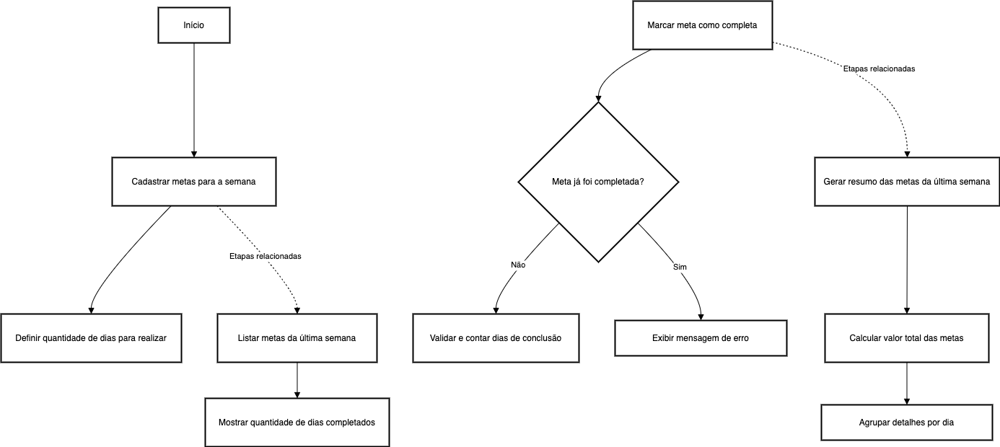

<div align="center">
  <h1>in.orbit-api</h1>
  <p>in.orbit-api é uma API Rest com o fim de realizar o gerenciamento de metas semanais, permitindo o cadastramento da meta, quantidade de dias que será realizada durante a semana, listagem, exibindo as metas da ultima semana baseando-se no dia atual com a contagem de dias que a meta foi realizada e permitindo a atualização de uma meta como concluída.</p>
  
</div>

# 📒 Índice
* [Descrição](#descrição)
* [Requisitos Funcionais](#requisitos)
  * [Features](#features)
* [Tecnologias](#tecnologias)
* [Endpoints](#endpoints)
* [Instalação](#instalação)
* [Licença](#licença)

# 📃 <span id="descrição">Descrição</span>
in.orbit-api é uma API Rest com o fim de realizar o gerenciamento de metas semanais, permitindo o cadastramento da meta, quantidade de dias que será realizada durante a semana, listagem, exibindo as metas da ultima semana baseando-se no dia atual com a contagem de dias que a meta foi realizada e permitindo a atualização de uma meta como concluída. Aplicação desenvolvida utilizando a tecnologia [**TypeScript**](https://www.typescriptlang.org/), com a biblioteca [**Fastify**](https://www.fastify.io/) para web server, [**Drizzle ORM**](https://orm.drizzle.team/) para manipulação de dados do banco e o banco de dados SQL [**MySQL**](https://www.mysql.com/), [**Zod**](https://github.com/colinhacks/zod) para as validações e [**biomejs**](https://biomejs.dev/) para formatter e linter para a sintaxe.
.

# 📌 <span id="requisitos">Requisitos Funcionais</span>
- [x] Cadastrar metas para a semana com quantidade de dias para realizar<br>
- [x] Listagem das metas da ultima semana com quantidade de dias que foram completados na semana<br>
- [x] Marcar meta como completa, validando se não foi completada antes e contando os dias de concluído<br>
- [x] Resumo das metas da ultima semana com valor total das mesmas e detalhes de cada uma agrupadas por dia<br>

## Features
- [x] Utilização de Common Table Expression (CTE)<br>

# 💻 <span id="tecnologias">Tecnologias</span>
- **TypeScript**
- **Fastify**
- **Zod**
- **drizzle-orm**
- **MySQL**
- **biomejs**

# 📍 <span id="endpoints">Endpoints</span>
| Método | Endpoint               | Resumo                                          
|--------|----------------------|-----------------------------------------------------
<kbd>POST</kbd> | <kbd>/goals</kbd> | Responsável por cadastrar uma nova meta para a semana informado titulo e quantidade dias a serem realizada(s)
<kbd>GET</kbd> | <kbd>/pending-goals</kbd> | Responsável por listar as metas da ultima semana com a contagem dos dias de frequência completados e não completados
<kbd>POST</kbd> | <kbd>/completions</kbd> | Responsável por validar e marcar como concluída uma meta da semana, informando o ID via corpo de requisição, identificando se todos os dias foram completados
<kbd>GET</kbd> | <kbd>/summary</kbd> | Responsável por listar um resumo das metas da ultima semana com valor total das mesmas e detalhes de cada uma agrupadas por dia
<kbd>GET</kbd> | <kbd>/docs</kbd> | Responsável por servir a documentação dos recursos da API

# 🚀 <span id="instalação">Instalação</span>
```bash
  # Clone este repositório:
  $ git clone https://github.com/CleilsonAndrade/in.orbit-api.git
  $ cd ./in.orbit-api

  # Instalar as dependências:
  $ yarn install

  # Aplicar migrações ao banco de dados:
  $ yarn drizzle-kit migrate

  # Aplicar seed:
  $ yarn seed

  # Executar:
  $ yarn dev
```

# 📝 <span id="licença">Licença</span>
Esse projeto está sob a licença MIT. Veja o arquivo [LICENSE](LICENSE) para mais detalhes.

---

<p align="center">
  Feito com 💜 by CleilsonAndrade
</p>
